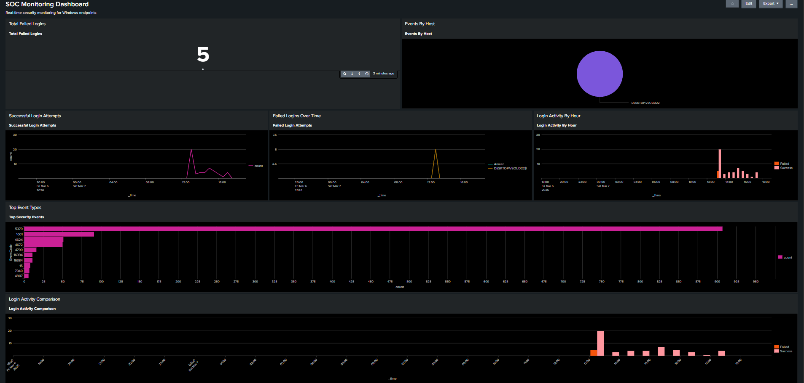
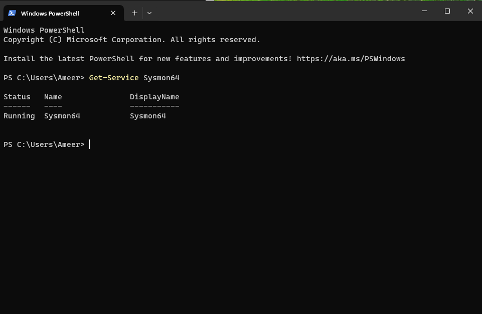
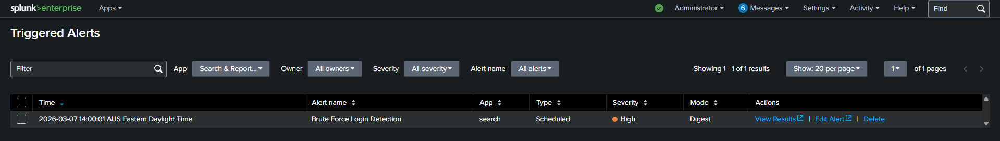
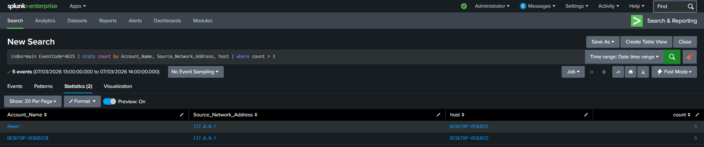
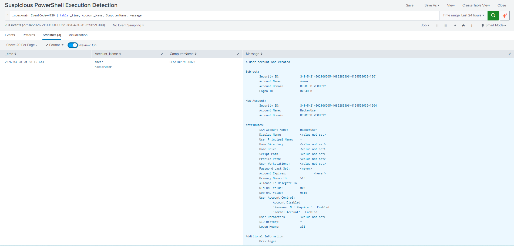
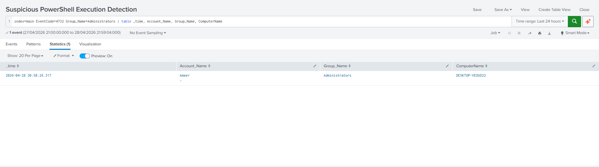
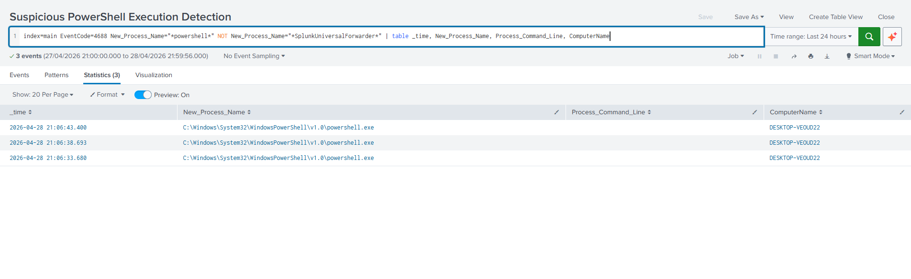

# SOC Home Lab – SIEM Monitoring & Threat Detection

A blue team home lab built to simulate a Security Operations Centre (SOC) environment. This project demonstrates hands-on experience with endpoint telemetry, SIEM configuration, detection engineering, and security monitoring dashboards.

---

## Overview

| Component | Tool |
|-----------|------|
| Virtualisation | VirtualBox |
| Endpoint | Windows 11 Enterprise (Evaluation) |
| Telemetry | Sysmon (SwiftOnSecurity config) |
| SIEM | Splunk Enterprise (Free License) |
| Log Forwarding | Splunk Universal Forwarder |

---
## SOC Dashboard


---

## Architecture

```
Windows 11 VM (VirtualBox)
  └── Sysmon + Windows Event Logs
        └── Splunk Universal Forwarder
              └── Splunk Enterprise (Host Machine)
                    └── Detections & Dashboard
```

The Windows 11 VM generates security telemetry via Sysmon and Windows Event Logging. The Universal Forwarder ships logs to Splunk over TCP port 9997 using a Host-Only network adapter. Splunk indexes the data and serves as the SIEM for detection and visualisation.

---

## Setup

### 1. Windows 11 VM
- Deployed Windows 11 Enterprise Evaluation via VirtualBox
- Configured Host-Only networking for isolated lab communication
- Installed VirtualBox Guest Additions for usability

### 2. Sysmon
- Installed Sysmon64 using the SwiftOnSecurity config
- Captures process creation (Event ID 1), network connections, file changes, and more
- Verified running as a Windows service

```powershell
.\Sysmon64.exe -accepteula -i sysmonconfig-export.xml
Get-Service Sysmon64  # Status: Running
```


### 3. Splunk Universal Forwarder
- Installed on the Windows VM
- Configured to monitor Windows Event Logs and Sysmon Operational log
- Forwards to Splunk Enterprise on the host at port 9997

Monitored sources:
- `C:\Windows\System32\winevt\Logs` (all Windows Event Logs)
- `Microsoft-Windows-Sysmon%4Operational.evtx`
- `Microsoft-Windows-PowerShell%4Operational.evtx`

### 4. Splunk Enterprise
- Installed on host machine
- Configured receiving on TCP port 9997
- Verified log ingestion: 22,000+ events indexed

---

## Detections Built

### 1. Brute Force Login Detection

**Description:** Identifies accounts with repeated failed authentication attempts — a key indicator of brute force or credential stuffing attacks.

**Event:** Windows Security Log – EventCode 4625 (Failed Logon)

**Splunk Search:**
```spl
index=main EventCode=4625
| stats count by Account_Name, Source_Network_Address, host
| where count > 3
```

**Alert Configuration:**
- Scheduled: runs every hour
- Trigger: results > 0
- Severity: High
- Action: Add to Triggered Alerts



**Simulated:** Deliberately entered incorrect passwords 5+ times on the Windows VM. Detection fired correctly, identifying the account name and source IP.



---

### 2. New User Account Creation

**Description:** Detects when a new local user account is created — a common attacker persistence technique used to maintain access after initial compromise.

**Event:** Windows Security Log – EventCode 4720 (User Account Created)

**Splunk Search:**
```spl
index=main EventCode=4720
| table _time, Account_Name, ComputerName, Message
```

**Simulated:** Created a test user account via PowerShell (`net user HackerUser /add`). Detection fired correctly identifying the new account name and host.



---

### 3. Privilege Escalation – Admin Group Addition

**Description:** Detects when a user is added to the local Administrators group — a key indicator of privilege escalation after initial access.

**Event:** Windows Security Log – EventCode 4732 (Member Added to Security-Enabled Local Group)

**Splunk Search:**
```spl
index=main EventCode=4732 Group_Name=Administrators
| table _time, Account_Name, Group_Name, ComputerName
```

**Simulated:** Added a test user to the Administrators group via PowerShell (`net localgroup administrators HackerUser /add`). Detection correctly identified the account and group.



---

### 4. Suspicious PowerShell Execution

**Description:** Detects PowerShell process creation events on the endpoint, filtering out known legitimate processes. PowerShell is one of the most commonly abused tools in attacker tradecraft.

**Event:** Windows Security Log – EventCode 4688 (Process Creation)

**Splunk Search:**
```spl
index=main EventCode=4688 New_Process_Name="*powershell*" 
NOT New_Process_Name="*SplunkUniversalForwarder*"
| table _time, New_Process_Name, Process_Command_Line, ComputerName
```

**Simulated:** Ran PowerShell commands with suspicious flags (`-nop -w hidden`) from the VM. Detection correctly captured the process execution events.



---

## SOC Dashboard

Built a multi-panel Splunk dashboard for real-time security monitoring:

| Panel | Description |
|-------|-------------|
| Total Failed Logins | Single value count of all EventCode 4625 events |
| Failed Logins Over Time | Line chart of failed login attempts by account |
| Successful Logins | Line chart of EventCode 4624 events over time |
| Login Activity Comparison | Success vs failed logins on same timechart |
| Top Security Events | Bar chart of top 10 EventCodes by frequency |
| Events by Host | Pie chart breaking down events by source host |

---

## Key Learnings

- Configured an end-to-end log pipeline from endpoint to SIEM
- Understood the difference between native Windows Event Logs and Sysmon telemetry
- Wrote detection rules in Splunk SPL covering brute force, persistence, privilege escalation, and execution techniques
- Enabled process creation auditing via auditpol to capture EventCode 4688
- Debugged VirtualBox network connectivity (NAT vs Host-Only adapters)
- Understood why Sysmon dramatically improves endpoint visibility compared to Windows logging alone

---

## What I Would Add Next

- **Kali Linux VM** – simulate attacks (port scans, password spraying) and validate detections
- **Atomic Red Team** – automated attack simulations mapped to MITRE ATT&CK
- **Sysmon EventCode 1 detections** – alert on suspicious process creation patterns
- **GeoIP enrichment** – add attacker location context to failed login alerts

---

## References

- [SwiftOnSecurity Sysmon Config](https://github.com/SwiftOnSecurity/sysmon-config)
- [Splunk Documentation](https://docs.splunk.com)
- [Microsoft Sysinternals – Sysmon](https://learn.microsoft.com/en-us/sysinternals/downloads/sysmon)
- [MITRE ATT&CK Framework](https://attack.mitre.org)
